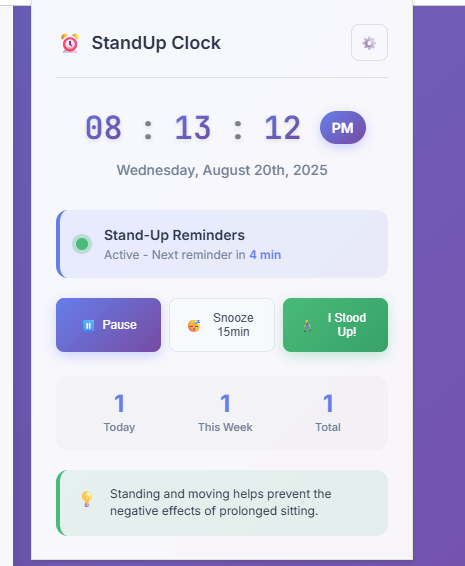

# StandUp Clock - Health Reminder Extension 

**Project 02** of 100 Days Projects Series

A beautiful Chrome extension that combines a digital clock with intelligent stand-up reminders to promote better health and productivity during work hours.



## 🌟 Features

### ⏰ Digital Clock
- **Real-time display** with hours, minutes, and seconds
- **12-hour format** with AM/PM indicator
- **Current date** with day name, month, date with ordinal suffix, and year
- **Modern glassmorphism design** with gradient backgrounds

### 🚶‍♂️ Health Reminders
- **Customizable intervals** from 5 minutes to 3 hours
- **Smart notifications** with motivational messages
- **Snooze functionality** for busy moments (15-minute snooze)
- **Working hours support** to avoid after-hours notifications
- **Quick action buttons** in notifications

### 📊 Activity Tracking
- **Daily stand-up counter** with reset at midnight
- **Weekly statistics** tracking your consistency
- **Total lifetime count** of all stand-ups
- **Visual progress indicators** and encouragement

### 🎛️ Customization Options
- **Multiple notification styles** (Friendly, Professional, Motivational)
- **Flexible reminder intervals** with quick preset buttons
- **Working hours configuration** to limit reminder times
- **Pause/resume functionality** for breaks and meetings

## 🛠️ Technologies Used

- **Manifest V3** - Latest Chrome extension standard
- **Service Workers** - Background processing for reminders
- **Chrome APIs** - Notifications, Alarms, Storage
- **Modern JavaScript** - ES6+ classes and async/await
- **CSS3** - Glassmorphism, animations, and responsive design
- **HTML5** - Semantic structure and accessibility

## 📁 Project Structure

```
Project-02-Standup-Clock-Extension/
│
├── manifest.json          # Extension configuration and permissions
├── popup.html             # Main interface (click extension icon)
├── popup.css              # Popup styling with glassmorphism design
├── popup.js               # Clock functionality and user interactions
├── background.js          # Service worker for reminders and notifications
├── options.html           # Settings page for customization
├── options.js             # Options page functionality
├── icons/                 # Extension icons in multiple sizes
│   ├── create-icons.html  # Tool to help create icon files
│   ├── icon16.png         # 16x16 icon (to be created)
│   ├── icon32.png         # 32x32 icon (to be created)
│   ├── icon48.png         # 48x48 icon (to be created)
│   └── icon128.png        # 128x128 icon (to be created)
└── README.md              # This documentation
```

## 🚀 Installation & Setup

### Prerequisites
- **Google Chrome** 88+ or **Chromium-based browser**
- **Developer mode** enabled in Chrome

### Installation Steps

1. **Download the extension:**
   ```bash
   # Clone or download the project
   cd Project-02-Standup-Clock-Extension
   ```

2. **Create the icons:**
   - Open `icons/create-icons.html` in your browser
   - Take screenshots of each icon size or use icon creation tools
   - Save as PNG files: `icon16.png`, `icon32.png`, `icon48.png`, `icon128.png`
   - Place all icon files in the `icons/` folder

3. **Load the extension in Chrome:**
   - Open Chrome and navigate to `chrome://extensions/`
   - Enable **Developer mode** (toggle in top-right)
   - Click **"Load unpacked"**
   - Select the `Project-02-Standup-Clock-Extension` folder
   - The extension should now appear in your extensions list

4. **Pin the extension:**
   - Click the puzzle piece icon in Chrome toolbar
   - Find "StandUp Clock" and click the pin icon
   - The extension icon will appear in your toolbar

### First-Time Setup

1. **Click the extension icon** to open the popup
2. **Click the settings gear** to customize your preferences:
   - Set your preferred reminder interval
   - Choose working hours (optional)
   - Select notification style
3. **Grant notification permissions** when prompted
4. **You're ready to go!** The extension will start tracking and reminding you

## 🎮 How to Use

### Main Interface (Popup)
- **Click the extension icon** to view the digital clock
- **Check your daily/weekly stats** at a glance
- **Use quick action buttons:**
  - **Pause/Resume** reminders
  - **Snooze for 15 minutes** when busy
  - **"I Stood Up!"** to record activity

### Notifications
When a reminder pops up:
- **"I Stood Up! ✅"** - Records the activity and resets timer
- **"Snooze 15min ⏰"** - Delays the next reminder
- **Click notification** - Opens the popup for more options

### Settings Page
- **Right-click extension icon** → "Options" or click settings gear
- **Customize reminder frequency** (30min, 1hr, 1.5hr, 2hr, or custom)
- **Set working hours** to avoid evening/weekend notifications  
- **Choose notification style** (Friendly, Professional, Motivational)
- **View detailed statistics** and track your progress

## ⚙️ Configuration Options

### Reminder Settings
```javascript
reminderInterval: 60,        // Minutes between reminders (5-180)
enableReminders: true,       // Master on/off switch
enableWorkingHours: false,   // Limit to work hours only
startTime: 9,               // Work start hour (24-hour format)
endTime: 17,                // Work end hour (24-hour format)
notificationStyle: 'friendly' // friendly | professional | motivational
```

### Notification Styles
- **Friendly**: "Time to stand up and stretch! 🧘‍♂️"
- **Professional**: "Reminder: Stand up for better health"
- **Motivational**: "ENERGY BOOST TIME! Stand up and power through! ⚡"

## 📈 Health Benefits

Regular stand-up breaks provide:
- **Improved circulation** and reduced blood clot risk
- **Better posture** and reduced back/neck strain  
- **Increased energy** and mental alertness
- **Enhanced productivity** and focus
- **Reduced eye strain** from screen time
- **Better metabolism** and calorie burning
- **Stress reduction** and mental health benefits

## 🔧 Technical Implementation

### Architecture Overview
```
┌─────────────────┐    ┌──────────────────┐    ┌─────────────────┐
│   Popup UI      │    │  Service Worker  │    │  Options Page   │
│                 │    │  (Background)    │    │                 │
│ • Digital Clock │    │ • Alarm Manager  │    │ • Settings UI   │
│ • Quick Actions │◄──►│ • Notifications  │◄──►│ • Statistics    │
│ • Stats Display │    │ • Data Storage   │    │ • Customization │
└─────────────────┘    └──────────────────┘    └─────────────────┘
         │                       │                       │
         └───────────────────────┼───────────────────────┘
                                 │
                    ┌─────────────────────┐
                    │  Chrome Storage API │
                    │ • User Preferences  │
                    │ • Activity Stats    │
                    │ • State Management  │
                    └─────────────────────┘
```

### Key Classes and Methods

#### `StandUpClockPopup` (popup.js)
```javascript
updateClock()           // Real-time clock updates
toggleReminders()       // Pause/resume functionality  
recordStandUp()         // Activity tracking
updateReminderStatus()  // UI state management
```

#### `StandUpClockBackground` (background.js)
```javascript
setupReminders()        // Alarm configuration
handleReminderAlarm()   // Notification triggers
showStandUpNotification() // Message display
handleRecordStandUp()   // Stats updating
```

#### `StandUpClockOptions` (options.js)
```javascript
loadSettings()          // Preferences management
saveSettings()          // Persistent storage
updateNotificationPreview() // Real-time preview
```

### Data Storage
```javascript
// Chrome Storage Sync - synced across devices
{
  reminderInterval: 60,
  isActive: true,
  stats: {
    today: 5,
    week: 23,
    total: 157
  },
  lastStandUp: 1640995200000,
  snoozeUntil: null
}
```

## 🎯 Learning Objectives

This project demonstrates:

1. **Chrome Extension Development**
   - Manifest V3 configuration
   - Service workers and background processing
   - Chrome APIs (notifications, alarms, storage)

2. **Modern JavaScript**
   - ES6+ classes and modules
   - Async/await and Promises  
   - Event-driven architecture

3. **User Experience Design**
   - Intuitive popup interface
   - Notification best practices
   - Settings and customization

4. **Data Management**
   - Local storage and syncing
   - Statistics tracking
   - State management

5. **Health & Productivity**
   - Behavior change techniques
   - Gamification elements
   - User engagement strategies

## 🛠️ Development & Customization

### Adding New Features
```javascript
// Example: Add new notification style
this.notificationMessages.energetic = [
    "POWER UP! Stand and conquer! 💪⚡",
    "Level up your energy! Stand now! 🎮🆙"
];
```

### Custom Reminder Logic
```javascript
// Example: Add weekend mode
if (this.isWeekend() && !this.settings.enableWeekends) {
    console.log('Weekend mode - skipping reminder');
    return;
}
```

### Styling Customization
```css
/* Custom color themes */
:root {
    --primary-gradient: linear-gradient(135deg, #your-color1, #your-color2);
    --accent-color: #your-accent;
}
```

## 🐛 Troubleshooting

### Common Issues

**Extension not loading:**
- Ensure all files are in the correct structure
- Check Developer mode is enabled
- Verify manifest.json syntax

**Notifications not showing:**
- Grant notification permissions
- Check if "Do Not Disturb" is enabled
- Verify Chrome notification settings

**Clock not updating:**
- Check popup.js for JavaScript errors
- Ensure DOM elements have correct IDs
- Verify clock update interval is running

**Background reminders not working:**
- Check service worker registration
- Verify alarm permissions in manifest
- Look for errors in background.js

### Debug Commands
```javascript
// In Chrome DevTools Console (Extension popup)
chrome.storage.sync.get(null, console.log);  // View all stored data
chrome.alarms.getAll(console.log);           // Check active alarms
```

## 🔮 Future Enhancements

### Planned Features
1. **Advanced Analytics**
   - Weekly/monthly trends
   - Best productivity hours analysis
   - Health goal tracking

2. **Integration Options**
   - Fitness tracker synchronization
   - Calendar integration for smart scheduling
   - Slack/Teams status updates

3. **Gamification**
   - Achievement badges and milestones
   - Streak challenges and rewards
   - Social sharing of progress

4. **Smart Features**
   - AI-powered optimal break suggestions
   - Meeting detection and auto-pause
   - Activity type recommendations (stretches, walks)

5. **Accessibility**
   - Screen reader support
   - Keyboard navigation
   - High contrast mode

### Contributing
Feel free to fork, modify, and improve this extension:
1. **Add new notification messages**
2. **Create custom themes/designs**  
3. **Implement additional health metrics**
4. **Add internationalization support**

## 📊 Performance & Privacy

### Performance
- **Lightweight** - Minimal memory footprint
- **Efficient** - Smart alarm scheduling
- **Responsive** - Fast UI updates and interactions

### Privacy
- **Local storage only** - No external servers
- **Chrome sync** - Optional cross-device synchronization
- **No tracking** - Zero analytics or user tracking
- **Minimal permissions** - Only necessary APIs requested

## 📚 Resources & References

### Chrome Extension Development
- [Chrome Extension Manifest V3](https://developer.chrome.com/docs/extensions/mv3/)
- [Chrome APIs Documentation](https://developer.chrome.com/docs/extensions/reference/)
- [Chrome Extension Best Practices](https://developer.chrome.com/docs/extensions/mv3/getstarted/)

### Health & Ergonomics
- [CDC Workplace Health Guidelines](https://www.cdc.gov/workplacehealthpromotion/)
- [Mayo Clinic - Office Ergonomics](https://www.mayoclinic.org/healthy-living/adult-health/in-depth/office-ergonomics/art-20046169)
- [Harvard Health - Sitting Disease](https://www.health.harvard.edu/blog/why-you-should-stand-up-and-move-naturally-every-day-201708301211)

### Design & UX
- [Material Design Guidelines](https://material.io/design)
- [Glassmorphism CSS Guide](https://css-tricks.com/glassmorphism/)
- [Chrome Extension UX Guidelines](https://developer.chrome.com/docs/extensions/mv3/user_interface/)

## 👨‍💻 About This Project

This is **Project 02** in the **100 Days of Projects** series. Building on the foundation of Project 01 (Digital Clock), this extension adds:
- **Chrome Extension ecosystem** knowledge
- **Background processing** and service workers
- **System notifications** and user engagement
- **Data persistence** and user preferences
- **Health/productivity** application domain

### Project Progression
- **Project 01**: Basic web technologies (HTML/CSS/JS)
- **Project 02**: Browser extensions and system integration ← *You are here*
- **Project 03**: Coming next... (What would you like to build?)

---

## 🎉 Ready to Stand Up for Your Health?

Install the **StandUp Clock extension** and start building healthier work habits today! 

**Remember**: Small changes lead to big improvements. Every stand-up counts! 💪

---

**Happy Coding & Healthy Working! 🎉**

*Ready for Project 03? Let's keep building amazing things together!*
